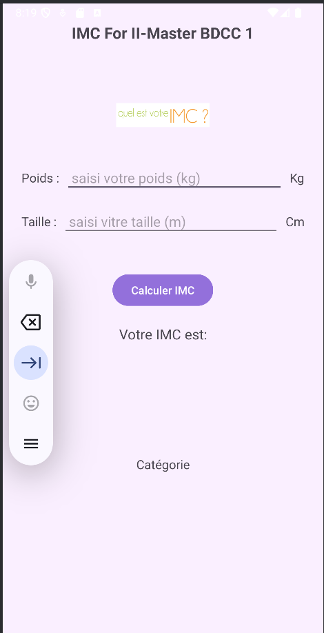
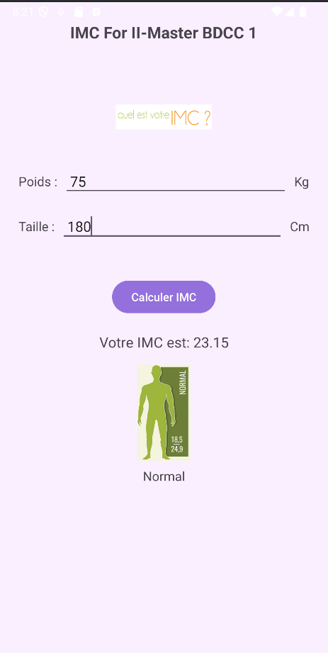
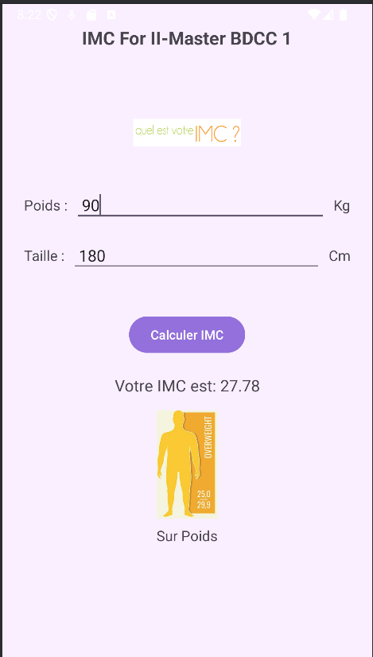
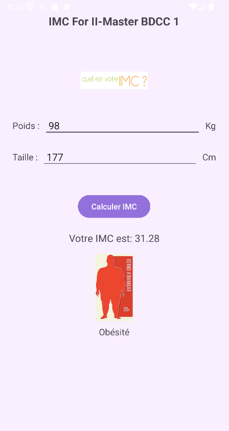

# 📱 Application Mobile - Calcul de l'IMC

Cette application Android permet de calculer l'Indice de Masse Corporelle (IMC) à partir du poids et de la taille saisis par l'utilisateur. Elle fournit également une catégorie de santé correspondant à l'IMC calculé (maigreur, normal, surpoids, obésité) accompagnée d'une image illustrative.

## 🛠️ Fonctionnalités

- Interface utilisateur simple et intuitive.
- Saisie du **poids (en kg)** et de la **taille (en cm)**.
- Calcul automatique de l'IMC avec une présentation du résultat.
- Affichage de la **catégorie** selon les normes de l'OMS.
- Image illustrative de chaque catégorie.
- Gestion des erreurs de saisie.

## 🔢 Formule utilisée

 #####         IMC = Poids (kg) / (Taille (m))²

### Seuils OMS

| IMC               | Catégorie    |
|-------------------|--------------|
| < 18.5            | Maigreur     |
| 18.5 à 24.9       | Normal       |
| 25 à 29.9         | Surpoids     |
| ≥ 30              | Obésité      |

## 🧱 Structure du projet

├── res\
│ ├── layout\
│ │ └── activity_main.xml  
│ ├── drawable\
│ │ ├── imc.png \\ 
│ │ ├── maigre.png \\
│ │ ├── normal.png \\
│ │ ├── surpoids.png \\
│ │ └── tobese.png \\ 
├── java/ma/enset/app_calcule_imc \\
│ └── MainActivity.kt \\ 
└── AndroidManifest.xml

## 🧪 Test

L'application a été testée sur un **émulateur Android**.Les cas suivants ont été vérifiés :

- Calcul correct de l’IMC.
- Affichage correct des images et catégories.
- Message d’erreur si un champ est vide.
- Résilience aux mauvaises entrées (valeurs nulles ou non numériques).

## 📸 Captures d'écran 

## 👤 Auteur

**Abdelwafi Laaouissi**
ENSET/ Université Mohammed V

